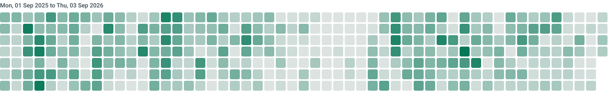

# ABC Distribution Material Management

[](https://wakapi.dev)

A PHP and PostgreSQL technical-exam project for managing electrical-supply materials across multiple distribution locations. It keeps each material's price, stock, availability, and activation status independent for every location.



## What it does

- Maintains a material registry with unique names, optional categories, stock thresholds, and a global active/inactive flag.
- Assigns a material to any number of locations: North, East, South, and West.
- Stores stock, price, branch status, and availability on the material-location assignment, so updating one location does not affect another.
- Creates, edits, and removes both materials and their location assignments.
- Generates a materials report with filters for location, registry status, branch status, and availability.

## Stack

- PHP 8.5 with PDO
- PostgreSQL
- Plain HTML and CSS
- Node.js/Express only for serving the optional static `dist/` output

## Data model

`product_branch` is the junction table that models the many-to-many relationship between materials and locations. Its unique `(branch_id, product_id)` index prevents duplicate assignments and its foreign key to `products` cascades on material deletion.

```text
categories 1 ──< products 1 ──< product_branch >── 1 branches
```

| Table | Purpose |
| --- | --- |
| `products` | Material registry, global status, category, and threshold |
| `categories` | Optional material categories |
| `branches` | Distribution locations |
| `product_branch` | Per-location stock, price, active status, and availability |

The source ERD is available in [db.dbml](db.dbml), and the PostgreSQL schema is in [db.sql](db.sql).

## Getting started

### Prerequisites

- PHP 8.5 or newer with the `pdo_pgsql` extension
- PostgreSQL

### 1. Create the database and schema

Create a database named `exam`, then load the schema:

```bash
createdb exam
psql -d exam -f schema.sql
```

Add the four required locations:

```sql
INSERT INTO branches (name)
VALUES ('North'), ('East'), ('South'), ('West');
```

`schema.sql` is also included as a PostgreSQL dump of the schema.

### 2. Configure the connection

Update [config.php](config.php) with your PostgreSQL host, port, and database name. The current application creates its PDO connection with the PostgreSQL user `postgres` and password `secret` in the controllers, so adjust those values locally if they differ in your environment.

### 3. Start the application

From the project root, use Laravel Herd server within the `public/` as the document root:

```bash
herd link exam
herd secure exam
```

Open <https://exam.test> for the report and <http://exam.test/manage> to manage materials and location assignments.

## Routes

| Route | Description |
| --- | --- |
| `/` | Material-by-location report with filters |
| `/manage` | Material registry and location assignment management |
| `/about` | Examination overview |
| `/actions/product` | POST endpoint for material create, update, and delete actions |
| `/actions/assignment` | POST endpoint for location assignment create, update, and delete actions |

## Project layout

```text
controllers/  Request handlers and mutation actions
views/        Report, management, and shared PHP templates
public/       Web entry point and stylesheets
db.sql        PostgreSQL schema definition
schema.sql    PostgreSQL final database schema
db.dbml       ERD source
router.php    Route map
```

## Exam scope

This implementation was built for the Limitless Solutions Inc. Full Stack Developer technical examination. The requested focus is correct relational design and per-location material behavior, demonstrated through the material registry, location-management module, ERD, and filtered reporting.
